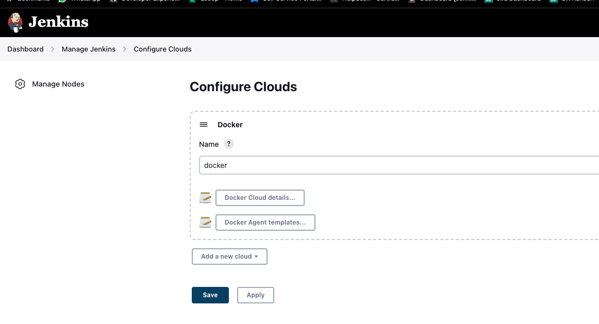
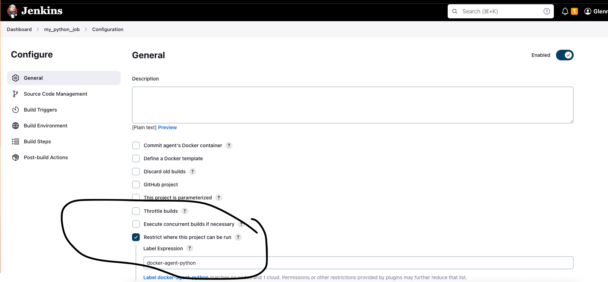

# What's this?
This repo contains the config for running Jenkins locally in a container. It includes the BlueOcean plugin. It also shows how to run a container with socat which will enable TCP communication between containers and the host. The reason for this is to allow the creation of Jenkins clouds and agents (running as their own containers) all within the host context.

This repo is a fork, to see the original details check out the video below.

## YouTube Link
For the full 1 hour course watch out youtube:
https://www.youtube.com/watch?v=6YZvp2GwT0A

# Installation
## Build the Jenkins BlueOcean Docker Image
```
docker build -t myjenkins-blueocean:latest .
```

## Create the network 'jenkins' (if it doesn't already exist)
```
docker network create jenkins
```

## Run the Container
### MacOS / Linux
```
docker run --name jenkins-blueocean --restart=on-failure --detach \
  --network jenkins --env DOCKER_HOST=tcp://docker:2376 \
  --env DOCKER_CERT_PATH=/certs/client --env DOCKER_TLS_VERIFY=1 \
  --publish 8080:8080 --publish 50000:50000 \
  --volume jenkins-data:/var/jenkins_home \
  --volume jenkins-docker-certs:/certs/client:ro \
  myjenkins-blueocean:latest
```


## Get the Password (if running for the first time)
```
docker exec jenkins-blueocean cat /var/jenkins_home/secrets/initialAdminPassword
```

## Connect to the Jenkins
```
https://localhost:8080/
```

## Installation Reference:
https://www.jenkins.io/doc/book/installing/docker/


## alpine/socat container to forward traffic 
From Jenkins to Docker Desktop on Host Machine

## Why are we doing this? 
We want to set up an agent to run jobs, basically we don't want to run jobs on the Master node. So we set up an agent. This agent will run on my own machine (the docker host). But since Jenkins is running in its own container it cannot TCP out to my host so I pulled and ran the alpine/socat image. This image allows us to expose a tcp socket for accessing docker API on macOS. I use the IPAddress of this container process to forward to our Jenkins container. The agent is set up on this socat container. 

https://stackoverflow.com/questions/47709208/how-to-find-docker-host-uri-to-be-used-in-jenkins-docker-plugin

## Run the alpine/socat container as follows:
```
docker run -d --restart=always -p 127.0.0.1:2376:2375 --network jenkins -v /var/run/docker.sock:/var/run/docker.sock alpine/socat tcp-listen:2375,fork,reuseaddr unix-connect:/var/run/docker.sock
docker inspect <container_id> | grep IPAddress
```

# Creating Clouds and agent templates
Once the socat container has been built and is running with the above parameters you can go ahead and create a cloud with some agents.
 - Go to Dashboard > Manage Jenkins > Configure Clouds to view our 'docker' cloud:

 

 Click on Docker Agent Templates to view the agent templates. Note, the labels, these will be used when telling Jenkins what jobs we want to be run on.


## Using my Jenkins Python Agent (use this image when configuring the cloud agent)
The agent container for running our python job can be grabbed from the parent repo:
```
devopsjourney1/myjenkinsagents:python
```

## Specifying agents to run specific jobs
You can explicitly tell Jenkins to run jobs on an agent by the following:

 

 Just make sure the agent label matches that back in your agent template config.

